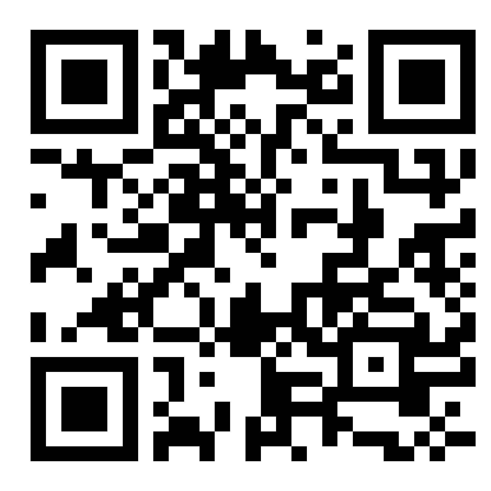

# Challenge Name: Alien Message

  
 


## Attached files
- challenge.txt
- solve.py
- flag.jpg


## Detailed solution
Analysing the text by eyes, i can assume that it's base32/64 encoding  
using cyberchef and decode the text with **base32**  

I finded two words IDEH and CTF, we can replace by 1 and 0  

```
111111111111111111111111111111111111111111111111111111111111111111
111111111111111111111111111111111111111111111111111111111111111111
111100000000000000110011110011111100001111000011000000000000001111
111100111111111100110011111111110000111111111111001111111111001111
111100110000001100111100111111000000111111110011001100000011001111
111100110000001100110000111111111111001111001111001100000011001111
111100110000001100111100000011001111111100001111001100000011001111
111100111111111100111100111111110011110000000011001111111111001111
111100000000000000110011001100110011001100110011000000000000001111
111111111111111111110011110011000011110000001111111111111111111111
111100110000110000001111001111000011000011110011001111001100001111
111100001111000011001100110000111100001111110011000000110000111111
111111110011001100001100000000110000110011110011111111110000111111
111111000000000011000011001100000000111100001100110011111100001111
111100000000111100110000000000111111001111110011111111000011111111
111111110000110011001100110000001111111100000000111111111111111111
111100000011111100111111001100110011110000000000111111110000001111
111111000011111111000000110000001100111111000011000000001100111111
111111110000110000001111001111111111111111001100110000000000111111
111111111100110011110011111100001111110000000011110011001111001111
111100110000001100111111111100111111110011110000110011001111111111
111111110011001111000011001100111100000000001100111100000000111111
111111001100001100110011111111001100110000110000000000110011111111
111111111111111111110011000000000000110011000011111100111100111111
111100000000000000110011111100001111000000110011001100111100111111
111100111111111100110000001111111111001100110011111100111100001111
111100110000001100111111001111110000111100110000000000001111001111
111100110000001100110011001111000011001111000000110000001100111111
111100110000001100110000000011000000000011111100110011110011001111
111100111111111100111111001111001111001100110000110011001100111111
111100000000000000110000111100001100110011000011000011111100111111
111111111111111111111111111111111111111111111111111111111111111111
111111111111111111111111111111111111111111111111111111111111111111  
```

by looking at the text we can see a visual patterns. It's a **QR-Code**  
     
we need to create an image with 0 representing black color. I used the python library **PIL**  
```python 
from PIL import Image, ImageDraw

#first decode the messge from base32 and replace IDEH by 1 and CTF by 0 (cyberchef cs im bad with py xd) -> alien.txt

im= Image.new("RGB", (32, 66), 'white')
f = open("C:/Users/maros/Downloads/alien.txt")

b = [line[:-1] for line in f]
pixels = im.load()
pi = []

for x in range(33):
    pi.append([int(d) for d in str(b[x])])
for x in range(32):   
    for y in range(66):
       if pi[x][y] == 0:
         pixels[x,y] = (0, 0, 0)    

     
im = im.resize((1880, 1880), Image.ANTIALIAS) #the image is too small 32x65
im.show()
im.save("alien.jpg")
```
The output :



## Flag
using a QR-Code reader : https://online-barcode-reader.inliteresearch.com/
```
IDEH{Qr_codes_are__0_or_1_?}
```
