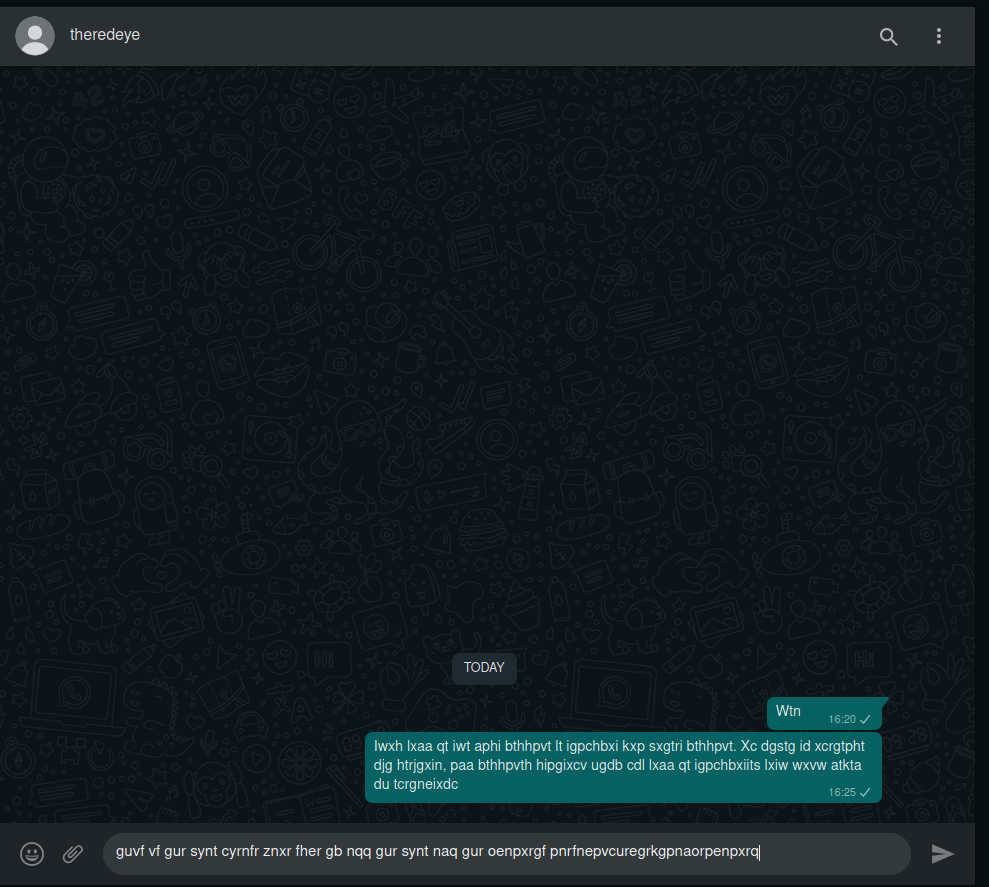

# Challenge Name: b4ack_To_R0ME 


  
   


## Attached files

- [l4stmsg.png](l4stmsg.png)


## Detailed solution

The challenge talk about a conversation between someone and a Roman general 



It's a decrypted text, challenge name and description talk about Roman so let's search Roman cipher

What cipher type Did the Romans use? Caesar Shift Cipher 

The Caesar Shift Cipher Was Used By the Roman Army. The cipher was named in honor of Julius Caesar who, according to Suetonius, used it to encrypt military and other official messages. As the majority of Rome's enemies were illiterate at this time the cipher remained secure for a time.
  
Use any OCR to get the text or you can type it, i used https://ocr.space/ (check if the text matched the one from the image)

```
lwxh Ixaa qt iwt aphi bthhpvt It igpchbxi kxp sxgtri bthhpvt Xc dgstg id xcrgtpht
djg htrjgxin, paa bthhpvth hipgixcv ugdb cdl lxaa qt igpchbxiits Ixiw wxvw atkta
du tcrgneixdc 


guvf vf gur synt cyrnfr znxr fher gb nqq gur synt naq gur oenpxrgf pnrfnepvcuregrkgpnaorpenpxrq
```  

Let's decrypt the CAESAR SHIFTED CIPHERTEXT, i used https://www.dcode.fr/caesar-cipher  

The shift used for the first message is +15  

```
whis Till be the last message Te transmit via direct message In order to increase
our security, all messages starting from now will be transmitted Tith high level
of encryption
``` 

The shift used for the second message is +13. It has been changed as we see in the first decrypted message

```
this is the flag please make sure to add the flag and the brackets caesarciphertextcanbecracked
```

## Flag

```
IDEH{caesarciphertextcanbecracked}
```
