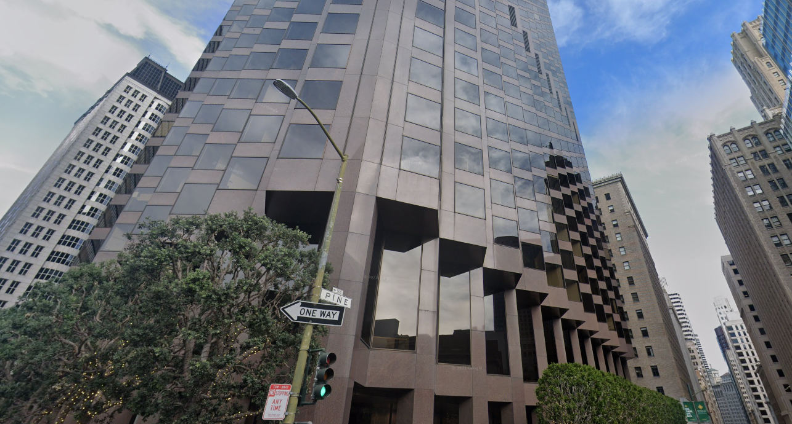

# Challenge Name: Traveling


  
   
   
  


## Description

I've been walking along the streets of this cool city and saw this neat looking building, but can't quite remember its name. Can you help me out?

Flag format: UMDCTF-{This is the Flag Format}

https://drive.google.com/drive/folders/1D9dBgba101Tp7R4hlBG4-CmGqmafoDtq?usp=sharing

## Detailed solution

Starting by looking at the picture from google drive link 



We can see the street plate with 500 Pine 


So i started by searching for the 500 Pine Street using google maps 

I found the building at 498 Pine St San Francisco, California 

https://www.google.com/maps/place/500+Pine+St,+San+Francisco,+CA+94108,+USA/@37.7917649,-122.4041956,3a,75y,43.48h,116.83t/data=!3m6!1e1!3m4!1sA5uO6gi14-DfyfNfW_zD0A!2e0!7i16384!8i8192!4m13!1m7!3m6!1s0x8085808bcbdf5e3d:0xc057aaa4ebd7a68!2s500+Pine+St,+San+Francisco,+CA+94108,+USA!3b1!8m2!3d37.7919436!4d-122.4045169!3m4!1s0x8085808bcbdf5e3d:0xc057aaa4ebd7a68!8m2!3d37.7919436!4d-122.4045169
  


The building name is **555 California Street Building** 


## Flag

```
UMDCTF-{555 California Street Building}
```

