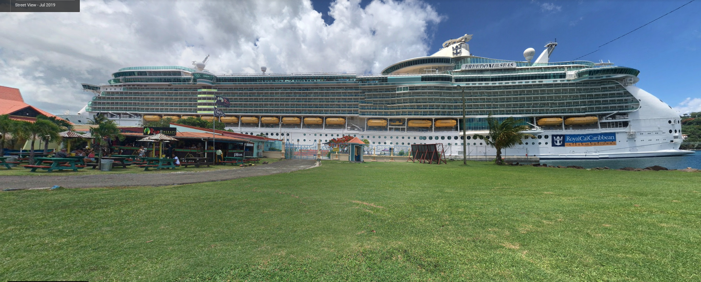

# Challenge Name: Vacation


  
   
   
  


## Description

My mom told me she went to this amazing brewing company in the Carribbean and when I asked her the name of the place, she sent me a picture of her ship. Can you help me find the name of this brewing company?

Flag format: UMDCTF-{City_Companyname}

Note: Companyname = first part of the company name

https://drive.google.com/drive/folders/14eh2f13z32Uf7WFVNHWqHGnXE0P8y8G-?usp=sharing

## Detailed solution

Starting by looking at the picture from google drive link

  

We can see the Freedom of the Seas a cruise ship operated by Royal Caribbean International. 

https://www.royalcaribbean.com/cruise-ships/freedom-of-the-seas

Checking article https://www.cruisecritic.com/news/5163/ 

Royal Caribbean’s recently-revitalized Freedom of the Seas has returned to San Juan, Puerto Rico, where it operates cruises to the Southern Caribbean.  

So our place is in the Southern Caribbean. I notice the rum therapy place so i searched for ```rum therapy Southern Caribbean``` and check google images 

I found the place "Rum Therapy Bar and Treatment Center" at Castries, St. Lucia

  

Search around for a brewing company, i found "Antillia Brewing Company Bar" which is close to the first bar 


Flag format: UMDCTF-{City_Companyname}  

- City : Castries 
- Companyname : Antillia

## Flag

```
UMDCTF-{Castries_Antillia}
```

